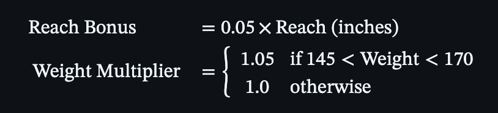
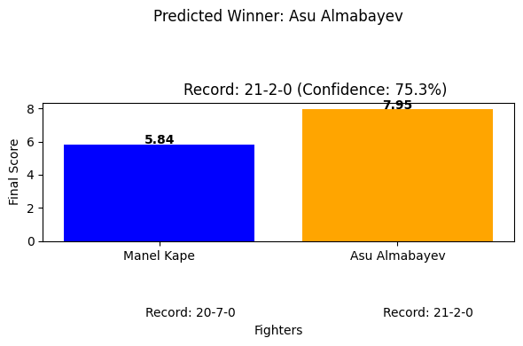
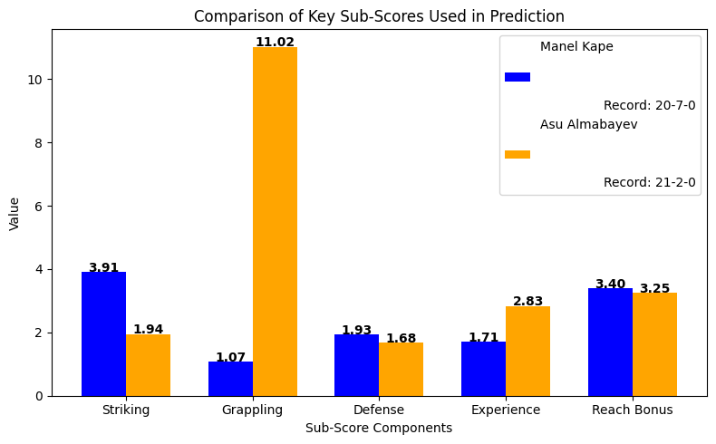

# UFC fighter prediction algorithm mini project

## Intro
I did this mini project to get a higher return on investment on prize pics... lol
This post will outline the mathematics applied to predict the most possible outcome of a fight against two UFC fighters only based on their statistics founds on ufcstats.com.
The algorithm takes into account performance metrics putting them together and making a score.

## 1. Data & processing
We scraped data from the ufcstats.com website by pulling the html code and extracting the data we needed.

Data collected:
- Height (inches), Weight (lbs), Reach (inches), Stance
- Striking: Strikes Landed per Minute (SLpM), Strike Accuracy (Str. Acc.), Strikes Absorbed per Minute (SApM), Strike Defense (Str. Def.)
- Grappling: Takedown Average (TD Avg.), Takedown Accuracy (TD Acc.), Takedown Defense (TD Def.), Submission Average (Sub. Avg.)
- Historical Data: Win-loss record, fight outcomes (KO/TKO, Submission), significant strikes per fight

Categorical features are assigned numbers:
- Stance: `1` for Orthodox, `0` for other
- Age: `(Current Date - DOB).days // 365`

## 2. Score Calculation
The fighter's final score is computed from a weighted combination of four core components

### 2.1 Striking Score
Striking effectiveness:

- **What we can infer**: High output is better and accuracy whilst poor defense brings the score down

### 2.2 Grappling Score
Ground game dominance:

- **What we can infer**: Emphasizes successful takedowns (3× weight) and submission attempts

### 2.3 Defense Score
Defensive skills:

- **Personal design choice**: I prioritized strike defense (2× weight) over takedown defense

### 2.4 Experience Score
Career performance and longevity/reliability:

- **Components**:
  - Win Rate: `Wins / Total Fights`
  - Stance (Bonus): `1` for Orthodox
  - Age Penalty: Linear decrease after the age of35

### 2.5 Physiological factos

### 2.6 Composition formula

Where:
- \( S \): Striking
- \( G \): Grappling
- \( D \): Defense
- \( E \): Experience
- \( R \): Reach Bonus
- \( W \): Weight Multiplier

## 3. Prediction confidence
Confidence comes from the score differential:

- **Heuristic Basis**: Each 1-point score difference ≈ 12% confidence boost
- **Range Clamping**: Maintains 50-99% bounds for realistic predictions

## 4. Comparative Analysis
Comparisons guide post-predictions:
1. **Striking Advantage**: `argmax(SLpM × Str. Acc.)`
2. **Grappling Advantage**: `argmax(TD Avg. + Sub. Avg.)`
3. **Volume Advantage**: `argmax(SLpM)`

## 5. Visualization
Two graph visualizations make it easier to compare data:
1. **Total Score**: Bar chart with prediction confidence
2. **Subscore**: Bars comparing striking, grappling, defense, experience, and reach

## 6. Issues
1. **Prediction issues**:
   - My algorithm oversimplified the MMA nonlinear dynamics
   - Fixed weights need to be validated  through historical data
   - Excludes opponent-specific matchup analysis
   - The data is restricted to one stats website that might not have the most accurate data than other websites

2. **Enhancement Opportunities**:
   - Incorporate temporal trends (recent performance weighting)
   - Add weight class-specific coefficients
   - Include clinch and ground control metrics

## Output images

